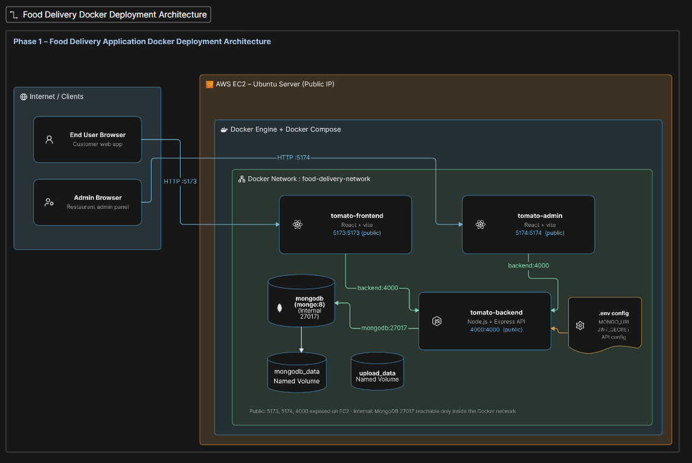

# Food Delivery Application – Dockerization & AWS EC2 Deployment

A full-stack Food Delivery application containerized using **Docker and Docker Compose** and deployed on an **Ubuntu AWS EC2 instance**.

## Project Overview

The application is a MERN-based food ordering platform consisting of:

* **Frontend:** React + Vite
* **Admin Panel:** React + Vite
* **Backend:** Node.js + Express
* **Database:** MongoDB

The application was containerized, optimized using multi-stage Docker builds, configured with Docker networking and persistent volumes, and deployed on AWS EC2.

## Objectives

* Containerize the full-stack application using Docker
* Manage multiple services using Docker Compose
* Implement a custom Docker network for service communication
* Configure persistent storage using named Docker volumes
* Optimize Docker images using multi-stage builds and Docker Hardened Images (DHI)
* Deploy and test the application on AWS EC2

## System Architecture
The application follows a 3-tier architecture consisting of the Frontend, Admin Panel, Backend API, and MongoDB database. All services run as separate Docker containers and communicate through a custom Docker bridge network.
```text
                         AWS EC2
                    Public IP Address
                           │
             ┌─────────────┼─────────────┐
             │             │             │
             ▼             ▼             ▼
       Frontend        Admin Panel     Backend API
       Port 5173       Port 5174       Port 4000
       React + Vite    React + Vite    Node.js + Express
             │             │             │
             └─────────────┼─────────────┘
                           │
              food-delivery-network
                    Docker Bridge
                           │
                           ▼
                    MongoDB Container
                       Port 27017
                    Internal Only
                           │
                           ▼
                    mongodb_data
                    Docker Volume

                    Backend
                       │
                       ▼
                  uploads_data
                  Docker Volume
                  /app/uploads

```


| Service     | Container         | Port    | Purpose                                      |
| ----------- | ----------------- | ------- | -------------------------------------------- |
| Frontend    | `tomato-frontend` | `5173`  | User-facing food delivery application        |
| Admin Panel | `tomato-admin`    | `5174`  | Admin dashboard for managing the application |
| Backend     | `tomato-backend`  | `4000`  | REST API and application logic               |
| MongoDB     | `tomato-mongodb`  | `27017` | Database used internally by the backend      |

This architecture provides container isolation, service-name-based communication, and persistent storage using Docker volumes.


## Docker Services

| Service  | Container         |             Port | Purpose     |
| -------- | ----------------- | ---------------: | ----------- |
| Frontend | `tomato-frontend` |      `5173:5173` | User Panel  |
| Admin    | `tomato-admin`    |      `5174:5174` | Admin Panel |
| Backend  | `tomato-backend`  |      `4000:4000` | REST API    |
| MongoDB  | `tomato-mongodb`  | Internal `27017` | Database    |

## Docker Networking

A custom Docker bridge network named **`food-delivery-network`** is used for communication between services.

* All four containers are connected to the same network.
* Containers communicate using **service names instead of hardcoded IP addresses**.
* Backend connects to MongoDB using the service name `mongodb`.
* Frontend and Admin communicate with the Backend through the Docker network.
* Only the required application ports are exposed publicly.
* MongoDB is kept internal to the Docker network and its database port is not intended for public access.

## Persistent Storage

Two named Docker volumes are used:

| Volume         | Mount Point    | Purpose                        |
| -------------- | -------------- | ------------------------------ |
| `mongodb_data` | `/data/db`     | Persists MongoDB database data |
| `uploads_data` | `/app/uploads` | Persists uploaded food images  |

This ensures that database records and uploaded images remain available even when containers are stopped or recreated.

## Docker Image Optimization

The application uses **multi-stage Docker builds** for the Frontend, Admin Panel and Backend.

### Build Stage

```text
dhi.io/node:24-alpine-dev
```

Used for:

* Installing dependencies
* Running application builds
* Providing required development/build tools

### Runtime Stage

```text
dhi.io/node:24-alpine
```

Used for:

* Running the application
* Keeping unnecessary development/build tools out of the runtime image
* Reducing image size and attack surface

### Image Size Comparison

| Service  | Before |  After |
| -------- | -----: | -----: |
| Frontend | 398 MB | 282 MB |
| Admin    | 358 MB | 262 MB |
| Backend  | 268 MB | 209 MB |

Multi-stage builds and minimal DHI runtime images helped reduce the final Docker image sizes.

## Project Structure

```text
Food-Delivery-dockerization/
│
├── frontend/
│   ├── Dockerfile
│   └── Dockerfile.multistage
│
├── admin/
│   ├── Dockerfile
│   └── Dockerfile.multistage
│
├── backend/
│   ├── Dockerfile
│   └── Dockerfile.multistage
│
├── .env
├── docker-compose.yml
├── .gitignore
└── README.md
```

## Environment Variables

Create a `.env` file in the project root:

```env
JWT_SECRET=your_jwt_secret
SALT=your_salt_value
MONGO_URL=mongodb://mongodb:27017/your_database
STRIPE_SECRET_KEY=your_stripe_secret_key
```

> Do not commit `.env` or other secrets to GitHub.

##  Run with Docker Compose

Clone the repository:

```bash
git clone https://github.com/vaishnavipawardottech/Food-Delivery-dockerization.git
cd Food-Delivery-dockerization
git checkout dockerization
```

Create the `.env` file with the required values and then build and start all services:

```bash
docker compose up -d --build
```

Check running containers:

```bash
docker compose ps
```

View logs:

```bash
docker compose logs
```

Stop the application:

```bash
docker compose down
```

## Verify Docker Network

List networks:

```bash
docker network ls
```

Inspect the custom network:

```bash
docker network inspect food-delivery-network
```

The network inspection should show:

* `tomato-frontend`
* `tomato-admin`
* `tomato-backend`
* `tomato-mongodb`

connected to the same Docker network.

## Application Ports

After starting the application:

* **User Panel:** `http://localhost:5173`
* **Admin Panel:** `http://localhost:5174`
* **Backend API:** `http://localhost:4000`
* **MongoDB:** Internal Docker network


##  AWS EC2 Deployment

The Dockerized application was deployed on an **Ubuntu AWS EC2 instance**.

Deployment included:

1. Launching an Ubuntu EC2 instance
2. Installing Docker and Docker Compose
3. Cloning the Dockerized project
4. Configuring environment variables
5. Building Docker images
6. Starting services using Docker Compose
7. Configuring AWS Security Group rules
8. Verifying the User Panel, Admin Panel, Backend and MongoDB connectivity

## Security

* Secrets are managed using environment variables.
* `.env` is excluded using `.gitignore`.
* Containers communicate through the private Docker network.
* MongoDB is not intended to be publicly exposed.
* Only required application ports are exposed through the EC2 Security Group.
* Runtime images use minimal Docker Hardened Images.

## Verification

The deployment was tested for:

* User Panel accessibility
* Admin Panel accessibility
* Backend API connectivity
* MongoDB connectivity
* Admin-side product management
* User-side product visibility
* Uploaded image availability
* Data persistence after container restart
* Docker network connectivity


##  Key Learnings

* Dockerizing a full-stack application using separate containers
* Writing and optimizing Dockerfiles
* Multi-stage Docker builds
* Docker Compose service orchestration
* Docker networking and service-name-based communication
* Named volumes and data persistence
* Docker Hardened Images
* Environment variable management
* AWS EC2 deployment
* AWS Security Groups
* Container troubleshooting and debugging

## Author

**Vaishnavi Pawar**

## Acknowledgement

Special thanks to **Shubham Londhe Sir** for making the learning practical and helping us build confidence through hands-on DevOps work.
